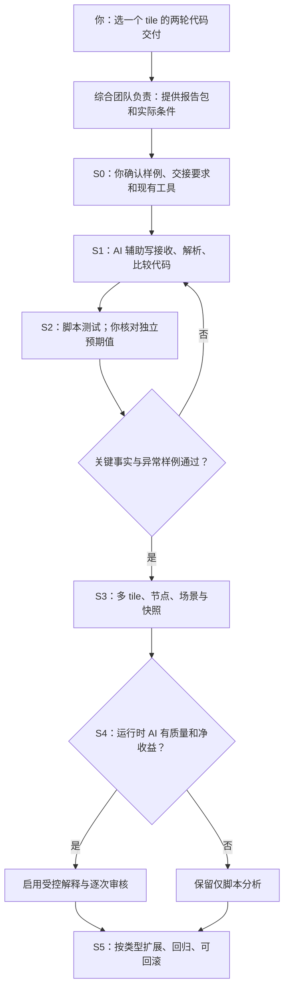
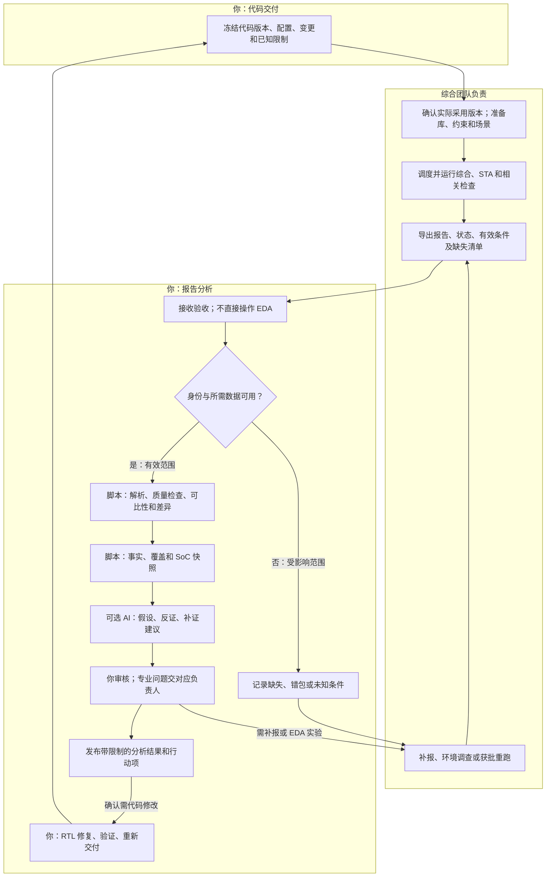
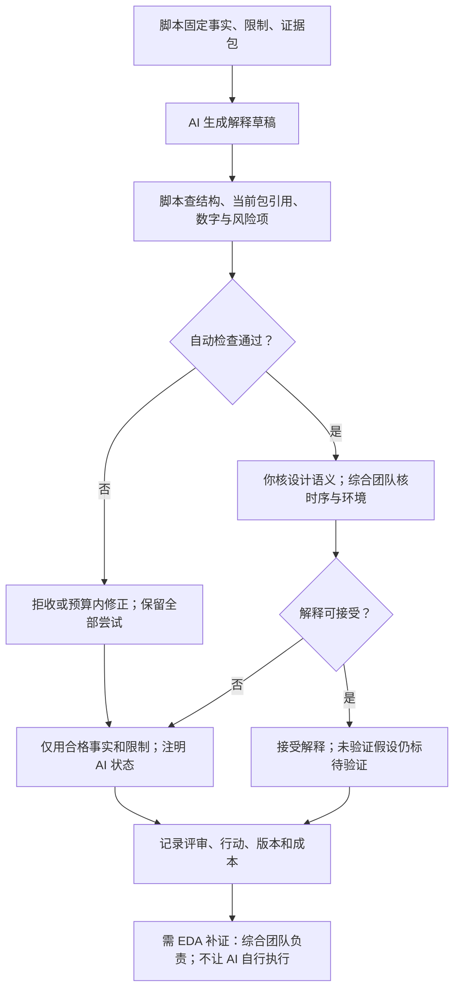

# 05｜三张图看懂建设、协作和质量控制

> v2.0 · 2026-10-10｜[入口](README.md)。当前图以文内 Mermaid 为准；此前 PNG 是历史示意，不能据其旧职责分工执行。图中模块是计划，不代表程序已实现。

## 图一：你如何把 plan 落地

不先开发综合调度、EDA wrapper、库管理和原生报告生成器；这些环节**综合团队负责**。你仅约定接口、提出缺口、验收分析所需证据。

## 图二：每轮跨团队工作流

“数据可用”按指标/范围判断：部分数据有效可继续相应分析，缺口仍显示。综合团队导出失败/部分包也要登记；没有回包是待回包，不是成功。补报与重新运行分别留 revision/run 记录。

## 图三：AI 波动不改变事实

自动检查不证明因果正确；模型一致不等于独立真值。数据失败不能走“仅事实页”伪装正常；只有已合格的事实才可保留。

## 图与文档的对应

建设/操作见[03](03-实施操作与验收评估.md)，字段规则见[02](02-数据契约与比较规则.md)/[06](06-流程分阶段实施明细表.md)，AI 权限和测试见[04](04-AI脚本人工分工与质量控制.md)。

内部目录先保留 `deliveries/、received/（只读）、config/、src/、tests/、outputs/、TASKS.md` 即可。输出分 `facts/、ai/、review/`；运行 AI 不具有回写 facts/config 的权限。真实数据不回传公开 GitHub。
