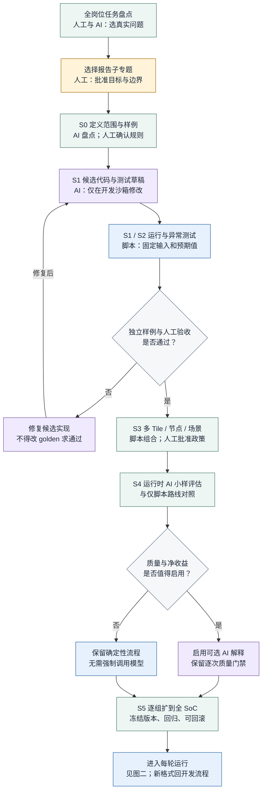
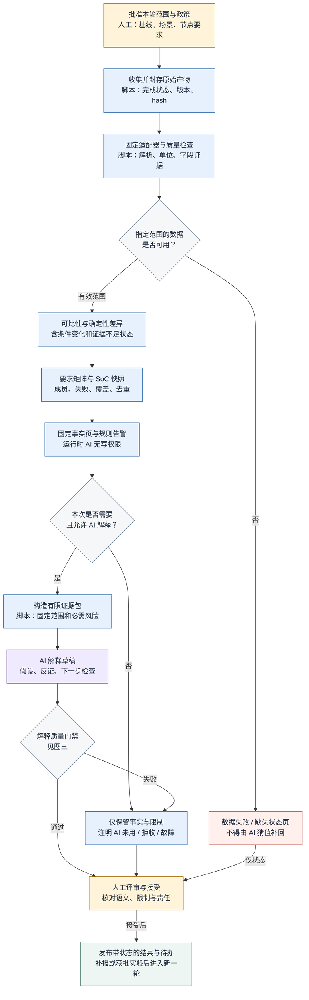
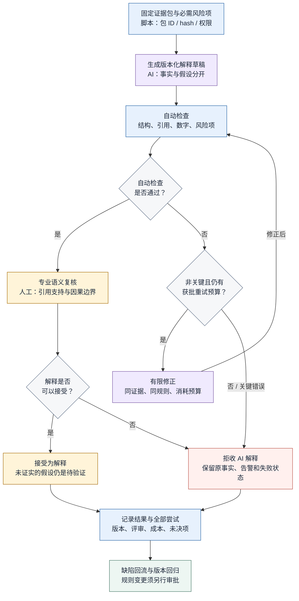

# 从 Plan 到日常运行：三张流程图

> v1.0｜2026-10-09｜工程方案图，非已实现系统。  
> 配套：[AI／脚本／人工分工与质量控制](04-AI脚本人工分工与质量控制.md)｜[专题入口](README.md)。

## 先读这段：三张图不是三个同时启动的 agent

**图一讲怎么把 plan 建成工具，图二讲工具建好后每轮怎么运行，图三展开图二的 AI 质量门禁。** AI 可以从开发第一天参与，正式数值仍由测试过的脚本与适用 EDA 工具产生。运行时 AI 解释可选，不能阻断已验证的确定性流程。

图例：黄色＝人工确认/批准；蓝色＝脚本/工具；紫色＝模型生成；绿色＝多方协作；灰色菱形＝门禁；红色＝失败/降级。节点内也写明职责，不依赖颜色识别。

图中脚本、校验器、调度器和评估动作都是拟实现功能，不因画在图上就代表仓库已有对应程序。只读、审批与预算需要实际权限系统实现，不是画一条线就生效。

## 图一：整个 plan 如何落地

先从全岗位真实任务中选题；选中本子专题后，先完成单 tile 两轮的可验收闭环。S4 的“运行时 AI 有净价值”判断失败，并不推翻 S1—S3 的工具价值。



### 图一怎样使用

| 当前步骤 | 应交付的东西 | 下一阶段之前谁确认 |
|---|---|---|
| S0 | 输入盘点、首个样例、未知项、TASKS.md | 你确认范围；STA/CAD 确认必要语义和已有工具 |
| S1/S2 | 固定适配器/差异程序、独立预期值、异常和未见样例结果 | 工程负责人核对事实与比较条件 |
| S3 | 要求矩阵、明确成员的 SoC 快照、覆盖与去重结果 | 集成/STA 负责人批准节点和边界政策 |
| S4 | 同证据包的 AI 输出、失败记录、人工修改与净收益对照 | 使用方和相关专业负责人 |
| S5 | 适用范围、固定版本、运行说明、回归与回滚依据 | 按内部上线与变更制度批准 |

读图时的“通过”只针对本阶段范围。一个格式的样例通过，不代表所有 tile、corner、节点都支持；单 tile 分析通过，不代表 SoC 时序签核。

## 图二：plan 中计划的每轮工作流

本图的默认输入是**已完成的现有报告**，不意味着收到任务就启动新综合。脚本按批准的要求集合处理失败和缺失；有效的部分可以保留，不把局部有效升级为整个 run 或 SoC 通过。



### 图二中最重要的四条边界

**数据失败分支与 AI 失败分支不同。** 数据失败时显示缺失/失败状态，不能生成虚假的正常事实页。AI 失败时，已经合格的确定性事实和限制仍可保留。

**可比性先于解释。** 条件变化、证据不足也可以生成事实与限制说明，但不能被包装成同条件优化。

**事实页不经过模型重写。** 表格、数值、覆盖分母、条件差和规则告警由程序模板生成，模型只增补解释字段；重要风险不依赖模型有没有写出来。

**发布不等于签核。** 人工可以接受并发布一份如实显示“本轮不完整”的进度材料；这不意味着批准时序结果或关闭问题。新实验另行批准资源后进入已有 EDA 流程，其结果构成下一轮输入。

## 图三：AI 输出波动、校验、失败与降级

模型输出先是草稿。自动检查通过之后仍有语义复核；引用存在不等于支持结论，格式正确不等于根因正确。重试仅适用于获准的非关键失败，并消耗有限预算，不允许改证据、换基线或重试到“通过”为止。



### 图三的验收边界

“接受为解释”不是“已验证根因”。实验与功能/时序验证尚未完成的候选依然标待验证。人工发现严重语义错误时直接拒收；需要改写时保留原答案、修改者和原因，不覆盖失败历史。

本图没有把全部语义检测冒充成程序能力。脚本检查结构、字段、已有数值和可形式化规则；跨资料含义和因果是否成立仍由专业负责人核对。错误反馈可以产生新测试或规则候选，但不能在生产运行中自动改变已批准规则。

## 图与文件、产物的对应

下列是建议内部目录和产物，不是公开仓库已有的分析软件：

```text
internal-soc-qor/
  docs/plan/          # 本方案、采用版本
  input/             # 原始产物，只读；包含失败记录
  config/            # 批准的范围、要求矩阵、基线与政策
  src/               # 固定版本的解析/比较/校验程序
  tests/             # 独立预期值、异常和未见样例
  outputs/<id>/
    facts/           # 数字、字段来源、质量、可比性、快照
    evidence/        # 固定证据包及内容散列
    ai/              # 全部尝试、解释草稿、拒收与版本
    review/          # 人工接受/退回、实验审批、限制和待办
  TASKS.md           # 当前任务、证据与阶段状态
```

关键关系是：`facts → evidence → ai → review`。运行时 AI 没有 `ai → facts/config` 的写入路径。需要纠正事实或规则时，回到图一的受测开发与审批流程，再生成新版本结果。

## 从哪里开始执行

第一步准备获准目录中的一个 tile、两轮历史报告、可确认的场景/工具/输入版本，以及当前已有脚本。将专题三份原文和本文复制到内部工作区，不把真实数据回传公开仓库。

把下面任务交给内部已获准客户端，先只做 S0：

```text
阅读本专题 04 分工与质量控制、05 流程图，以及 03 的启动部分。
仅盘点 input/ 和已有脚本，提出一个 tile 两轮的首个样例。
输出：work/启动记录.md 和 TASKS.md；列明 AI、脚本、人工分工、
输入、产物、验收条件、未知项、权限与预算。
不一次实现全系统；不改原报告、RTL、SDC、golden、正式基线或规则；
不新启动综合/STA，不发布结果。元数据缺失写未知，不能猜。
完成后停止，由我确认后再进入 S1。
```

每一阶段都要看真实文件和实际运行证据，不接受“理论应当通过”。当前没有提供一键分析命令；不能把文字任务合同误认为已实现的可执行程序。

## 图的维护与核验范围

三张图保留 Mermaid 源码，GitHub Markdown 支持将 `mermaid` 代码块渲染成流程图。[S1] 本次同一节点/连线定义另生成本地 SVG 并进行视觉检查；没有声称验证了公司客户端的 Mermaid 插件或 GitHub 服务端的具体渲染版本。

图与正文冲突时应修正文图，而不是让 AI 自行选择更宽松规则。设计边界以本专题 02、03、04 和内部批准政策为准；图是导航，不是绕过验收的授权。

- [S1] GitHub 官方 Creating diagrams：<https://docs.github.com/en/get-started/writing-on-github/working-with-advanced-formatting/creating-diagrams>。核验：2026-10-09；仅支持图文展示方式，不背书本方案的工程正确性。
